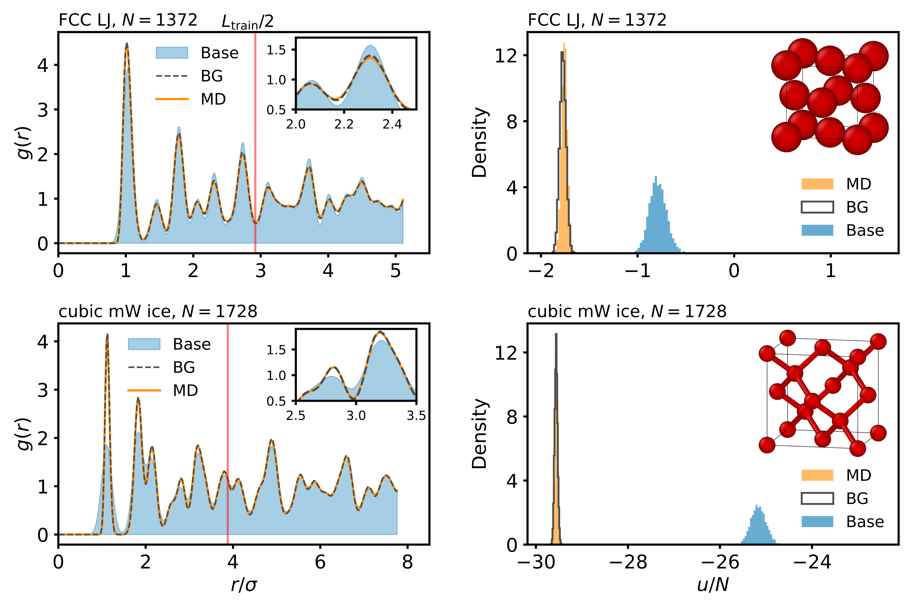

# Scalable Boltzmann Generators for equilibrium sampling of large-scale materials
Maximilian Schebek, Jutta Rogal 

[](https://arxiv.org/abs/2509.25486)

This repository provides the code for training and evaluating scalable Boltzmann Generators for large-scale materials, accompanying our paper. The code builds on the implementation by Wirnsberger et al. [1,2] and extends it with additional features and modifications for our study.


## Abstract
The use of generative models to sample equilibrium distributions of many-body systems, as first demonstrated by Boltzmann Generators, has attracted substantial interest due to their ability to produce unbiased and uncorrelated samples in `one shot'. Despite their promise and impressive results across the natural sciences, scaling these models to large systems remains a major challenge. In this work, we introduce a Boltzmann Generator architecture that addresses this scalability bottleneck with a focus on applications in materials science. We leverage augmented coupling flows in combination with graph neural networks to base the generation process on local environmental information, while allowing for energy-based training and fast inference. Compared to previous architectures, our model trains significantly faster, requires far less computational resources, and achieves superior sampling efficiencies. Crucially, the architecture is transferable to larger system sizes, which allows for the efficient sampling of materials with simulation cells of unprecedented size. We demonstrate the potential of our approach by applying it to several materials systems, including Lennard-Jones crystals, ice phases of mW water, and the phase diagram of silicon, for system sizes well above one thousand atoms. The trained Boltzmann Generators produce highly accurate equilibrium ensembles for various crystal structures, as well as Helmholtz and Gibbs free energies across a range of system sizes, able to reach scales where finite-size effects become negligible.

## Installation
The package and all dependencies can be installed via
```
python -m pip install -e .
```
This will install a CPU version of JAX - if a GPU is available, it is recommended to remove jax and jaxlib from the setup.py and to install the GPU version following the instruction on the [JAX homepage](https://jax.readthedocs.io/en/latest/installation.html). We used JAX 0.4.32 with python 3.10.

## Structure of the code

The code is organized in the following folders:

* `experiments`: configuration files for Lennard-Jones and monatomic water experiments as well as training and evaluation scripts.
* `models`: modules to build normalizing flow models.
* `systems`: definition of interaction potentials used in this work.
* `tutorial`: contains a Jupyter notebook to train a small model from scratch on the 8-particle monatomic water system and evaluates trained models on larger systems.
* `utils`: utilities such as lattices and observables.

## Citation
```
@misc{schebek2025scalableboltzmanngeneratorsequilibrium,
      title={Scalable Boltzmann Generators for equilibrium sampling of large-scale materials}, 
      author={Maximilian Schebek and Jutta Rogal},
      year={2025},
      eprint={2509.25486},
      archivePrefix={arXiv},
      primaryClass={cond-mat.stat-mech},
      url={https://arxiv.org/abs/2509.25486}, 
}
```

## References
[1] [Wirnsberger, P. et al., 2022. *Normalizing Flows for Atomic Solids*, Machine Learning: Science and Technology, 3(2), 025009](https://doi.org/10.1088/2632-2153/ac6b16)  
[2] [Code on GitHub](https://github.com/google-deepmind/flows_for_atomic_solids)

---

