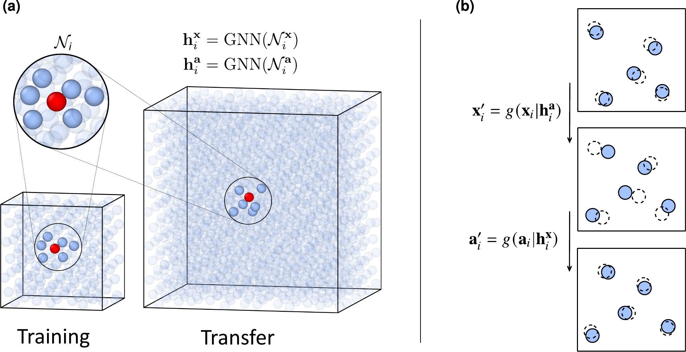

# Scalable Boltzmann Generators for equilibrium sampling of large-scale materials
Maximilian Schebek, Frank  Noé, Jutta Rogal 

[](https://arxiv.org/abs/2509.25486)
[](https://www.nature.com/articles/s41467-026-73900-9)

This repository provides the code for training and evaluating scalable Boltzmann Generators for large-scale materials, accompanying our paper. The code builds on the implementation by Wirnsberger et al. [1,2] and extends it with additional features and modifications for our study.


## Abstract
Generating equilibrium ensembles of structures is essential for modeling molecules and materials, yet traditional simulators like molecular dynamics suffer from limited sampling efficiency. Boltzmann Generators introduced the concept of one-shot deep learning for equilibrium sampling, but scalability to large systems has remained a major challenge. Here, we overcome this scaling limitation with a Boltzmann Generator architecture that can model large materials systems. Our approach combines augmented coupling flows with graph neural networks to exploit local environments, enabling energy-based training and rapid inference. Compared to previous designs, it trains faster, uses fewer resources, and achieves superior sampling efficiency. Crucially, it transfers to much larger system sizes, allowing efficient sampling of materials with simulation cells exceeding a thousand atoms. We demonstrate its capabilities on Lennard-Jones crystals, mW water ice phases, and the silicon phase diagram, producing accurate equilibrium ensembles and free energies across scales where finite-size effects vanish.

## Installation
The package and all dependencies can be installed via
```
python -m pip install -e .
```
This will install a CPU version of JAX - if a GPU is available, it is recommended to remove jax and jaxlib from the setup.py and to install the GPU version following the instruction on the [JAX homepage](https://jax.readthedocs.io/en/latest/installation.html). We used JAX 0.4.32 with python 3.10.

## Structure of the code

The code is organized in the following folders:

* `experiments`: configuration files for Lennard-Jones and monatomic water experiments as well as training and evaluation scripts.
* `models`: modules to build normalizing flow models.
* `systems`: definition of interaction potentials used in this work.
* `tutorial`: contains a Jupyter notebook to train a small model from scratch on the 8-particle monatomic water system and evaluates trained models on larger systems.
* `utils`: utilities such as lattices and observables.

## Citation
```
@Article{Schebek2026,
author={Schebek, Maximilian
and No{\'e}, Frank
and Rogal, Jutta},
title={Scalable Boltzmann generators for equilibrium sampling of large-scale materials},
journal={Nature Communications},
year={2026},
month={Jun},
day={05},
volume={17},
number={1},
pages={5010},
issn={2041-1723},
doi={10.1038/s41467-026-73900-9},
url={https://doi.org/10.1038/s41467-026-73900-9}
}

```

## References
[1] [Wirnsberger, P. et al., 2022. *Normalizing Flows for Atomic Solids*, Machine Learning: Science and Technology, 3(2), 025009](https://doi.org/10.1088/2632-2153/ac6b16)  
[2] [Code on GitHub](https://github.com/google-deepmind/flows_for_atomic_solids)

---

